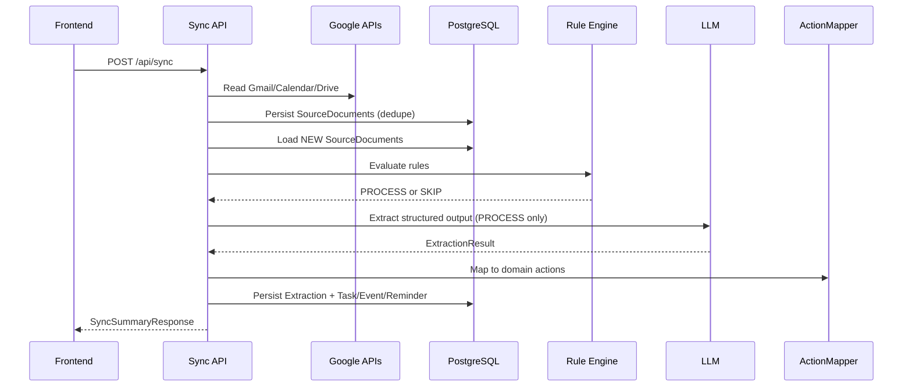

# LifeOS End-to-End Flow

## Overall Architecture

LifeOS uses a persist-first backend pipeline. External source data is normalized and persisted as `SourceDocument` before processing by Rule Engine and LLM.

```text
Google Sources
  -> NormalizedDocument
  -> SourceDocument (PostgreSQL)
  -> Rule Engine
  -> LLM
  -> ExtractionResult
  -> ActionMapper
  -> Task/Event/Reminder
  -> Frontend APIs
```

## Processing Pipeline

1. Read Gmail, Calendar, and Drive data.
2. Normalize into a provider-agnostic document shape.
3. Persist as `SourceDocument` (deduplicated by `provider + sourceType + externalId`).
4. Process only `NEW` source documents.
5. Apply rules and LLM extraction.
6. Persist extraction and mapped domain actions.
7. Expose data through read APIs.

## Sequence Diagram: Full Sync



## Frontend Integration Guide

Recommended API order:

```text
Login
  -> POST /api/sync
  -> GET /api/dashboard
  -> GET /api/tasks
  -> GET /api/events
  -> GET /api/reminders
  -> GET /api/timeline
  -> GET /api/search
```

## API Calling Order

Primary orchestration:

* `POST /api/sync`

Internal partial sync:

* `POST /api/google/sync/gmail`
* `POST /api/google/sync/calendar`
* `POST /api/google/sync/drive`

Domain read APIs:

* `GET /api/dashboard`
* `GET /api/tasks`, `GET /api/tasks/{id}`
* `GET /api/events`, `GET /api/events/{id}`
* `GET /api/reminders`, `GET /api/reminders/{id}`
* `GET /api/timeline`
* `GET /api/search?q=...`
* `GET /api/source-documents`, `GET /api/source-documents/{id}`

## Processing Lifecycle

```text
NEW -> PROCESSING -> PROCESSED
                \-> FAILED
                \-> SKIPPED
```

Only `NEW` documents are automatically processed.

## Seed Data Strategy

* Shared seed data is stored under `classpath:seed/*/*.json`.
* Seed import runs only when `source_documents` is empty.
* Seed import is idempotent through source deduplication.

## Database Strategy

* PostgreSQL is the operational database and system of record.
* SourceDocuments, extractions, and domain actions are persisted in PostgreSQL.
* Google Drive is for shared seed/sample/export workflows, not runtime state.

## Future Roadmap

* Phase 8: Frontend application integration
* Future: background workers for asynchronous sync/retry orchestration
